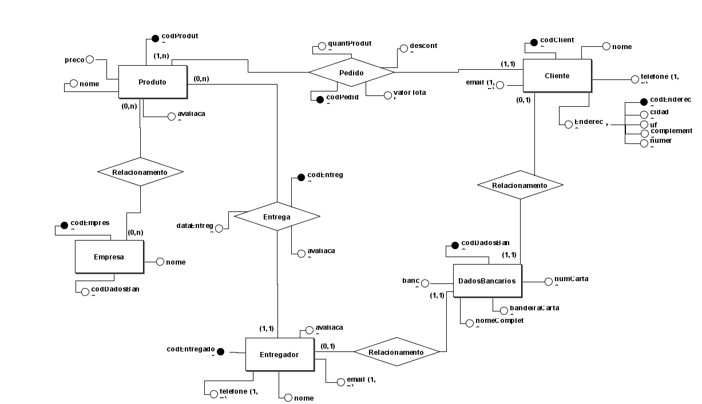
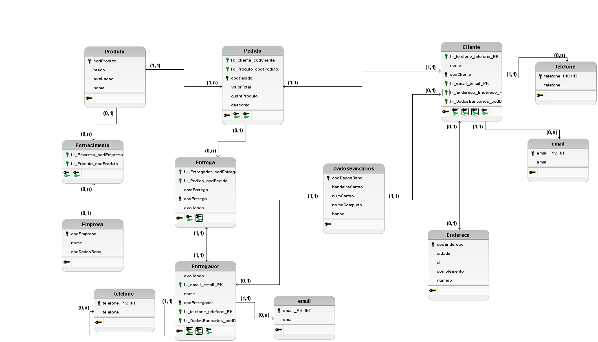
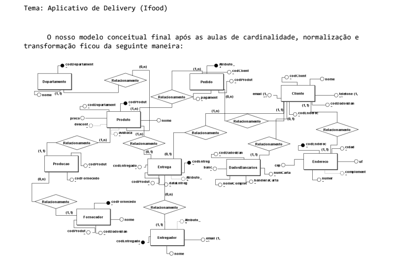
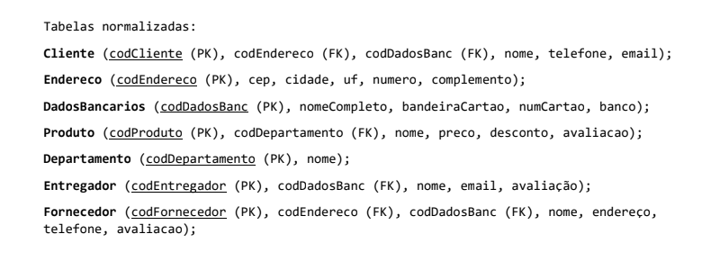
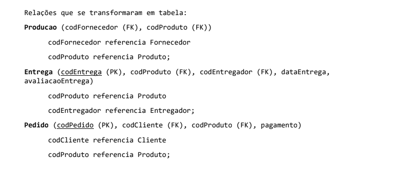

# Delivery DB
## Projeto de Banco de Dados desenvolvido em PostgreSQL.

### Tecnologias Utilizadas:
    - PostgreSQL
    - BrModelo
### Modelo Conceitual:

### Modelo Lógico:

### Transformação e Modelo Conceitual Final:

- Projeto de conclusão de matéria, com o tema de Banco de Dados para Aplicativos. No qual o tema, para o banco de dados realizado, foi Delivery (Entrega de Comida).